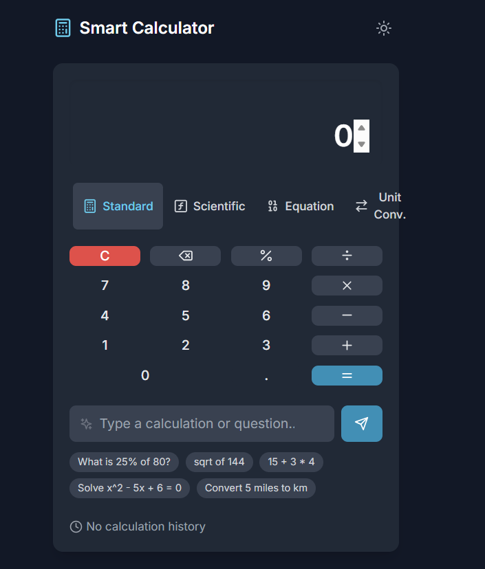
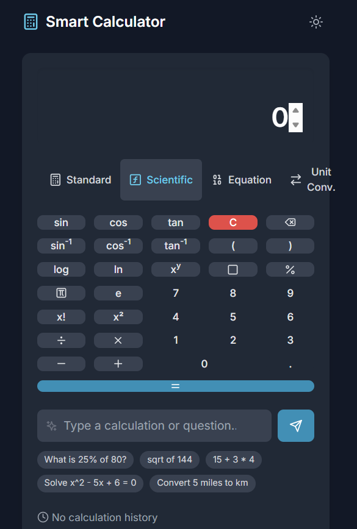
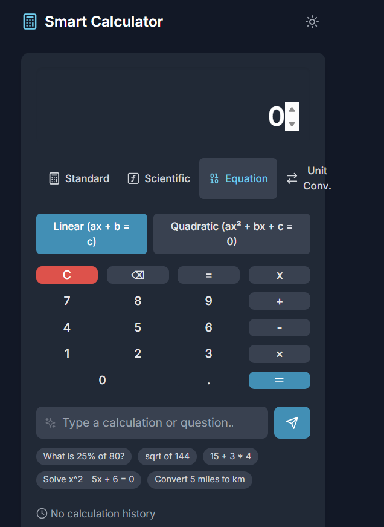
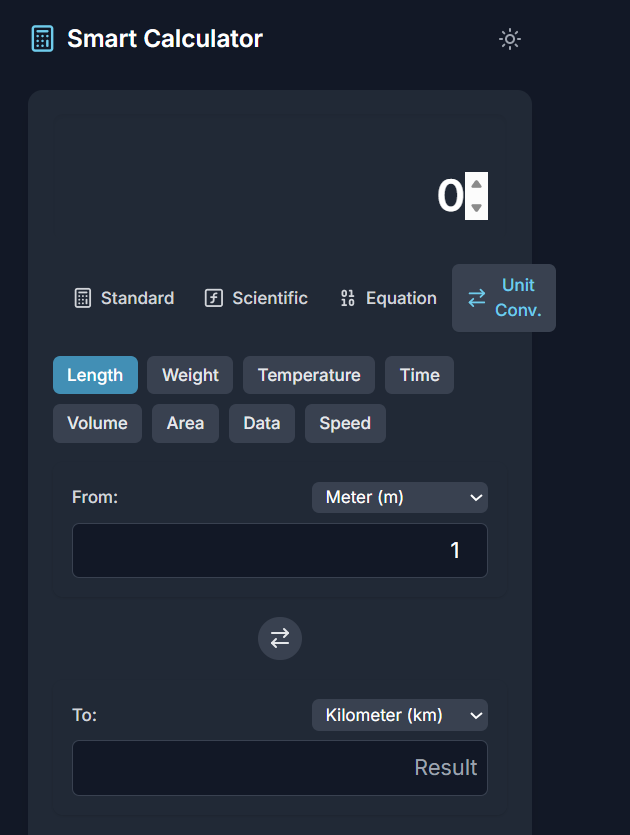
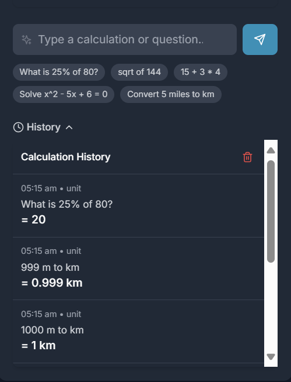

# Calcify – The Smart, Modern Calculator

**Calcify** is a sleek, intelligent calculator designed for real-world usability and clarity. It supports everything from basic arithmetic to advanced scientific functions, and goes beyond traditional calculators by providing **step-by-step explanations**, **natural language input**, and a responsive, visually refined UI.

---

## 🚀 Features

### 🔢 Core Functionality

- **Basic & Scientific Calculations**  
  Supports arithmetic operations, exponents, square roots, logarithms, and trigonometric functions.

- **Equation Solver**  
  Solve linear and quadratic equations with clear, step-by-step explanations to enhance learning.

- **Natural Language Input**  
  Parse common queries like “What is 25% of 180?” or “Solve x² + 5x + 6 = 0”.

- **Calculation History**  
  View, reuse, and copy previous calculations with ease.

- **Unit Converter**  
  Seamlessly convert between length, weight, temperature, and other common units.

- **Dark Mode**  
  Switch between light and dark themes for comfortable use in any lighting environment.

- **Memory Functions**  
  Store and recall values, just like a classic calculator — but smarter.

---

## 🎨 Design System

### ✨ Interface Style

- **Minimalist and modern** – Apple-inspired with generous white space
- **Clear visual hierarchy** – Easy-to-read layout and intuitive navigation
- **Responsive** – Fully adaptable to mobile, tablet, and desktop

### 🎨 Color Palette

| Name        | Hex                           | Purpose               |
| ----------- | ----------------------------- | --------------------- |
| Slate Blue  | `#3B4664`                     | Primary background    |
| Bright Cyan | `#63CDDA`                     | Interactive accents   |
| Orange      | `#F97316`                     | Highlighting / alerts |
| Additional  | `Success`, `Warning`, `Error` | Status feedback       |

### 🧩 UI Details

- **8px spacing system** for visual consistency
- **Modern sans-serif typography** for clarity and balance
- **Custom tactile calculator buttons** with hover and active states
- **Smooth micro-interactions** and transition animations

---

## 📱 Fully Responsive

Calcify automatically adapts to:

- ✅ Mobile phones
- ✅ Tablets
- ✅ Desktop browsers

---

## 🔗 Live Demo

👉 **Check it out here:** (https://calcify-tau.vercel.app/)

---

## 📸 Preview

<strong>💻 Arithmetic Calculation</strong>

<strong>💻 Scientific Calculation</strong>

<strong>💻 Unit Conversion</strong>

<strong>💻 NLP Inputs</strong>

<strong>💻 History</strong>

---

## 🛠️ Tech Stack

- **Frontend**: React, TypeScript (or JavaScript)
- **Styling**: Tailwind CSS or CSS Modules
- **Math Engine**: [math.js](https://mathjs.org/) or custom parser
- **Deployment**: Vercel 

---

## 💡 Future Enhancements

- Voice input for hands-free calculations
- Graphing feature for visualizing equations
- Support for matrix operations and calculus
- Export history to CSV or PDF

---
